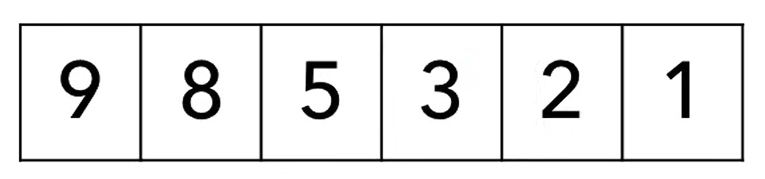
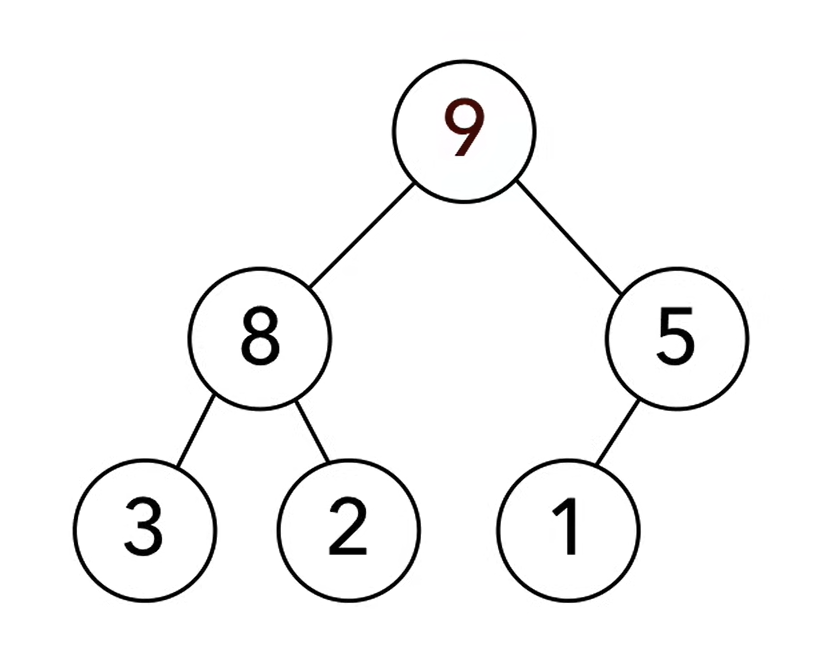
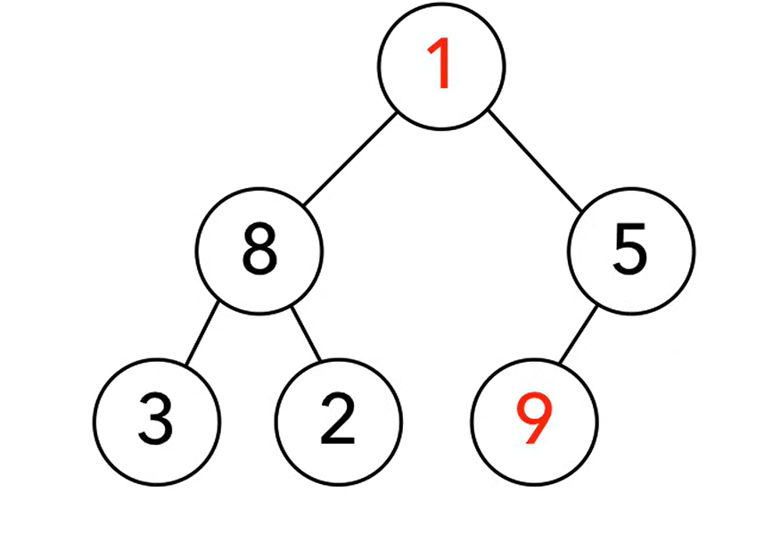
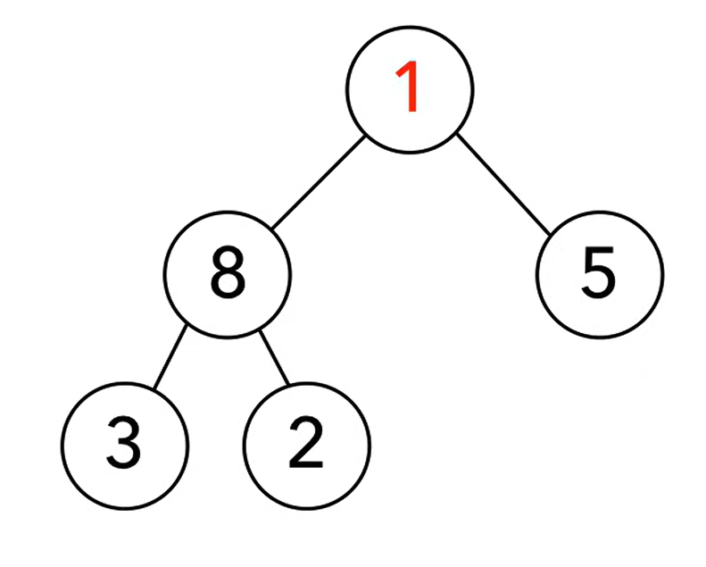
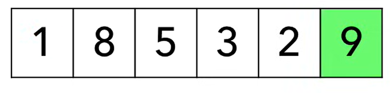

# Heap Sort – sortowanie przez kopcowanie

Sortowanie przez kopcowanie polega na zbudowaniu kopca maksymalnego
z elementów tablicy, a następnie wielokrotnym usuwaniu elementu maksymalnego
i umieszczaniu go na końcu tablicy wynikowej.

Algorytm korzysta z własności kopca, w którym **największy element zawsze
znajduje się w korzeniu**.

#### Właściwości

- złożoność czasowa:
  - **O(n log n)** – pesymistyczna  
  - **O(n log n)** – średnia  
- złożoność pamięciowa: **O(1)** – **sortowanie w miejscu**  
- algorytm **niestabilny**  
- niewrażliwy na początkowe uporządkowanie danych  
- zawsze wymaga budowy kopca  
- preferowany dla danych słabo uporządkowanych  

#### Idea algorytmu

- zbuduj kopiec maksymalny z tablicy
- zamień korzeń z ostatnim elementem
- zmniejsz rozmiar kopca
- napraw własność kopca (DownHeap)
- powtarzaj aż do posortowania tablicy

#### Wizualizacja

Mamy następujące elementy



Tworzymy z nich drzewo, gdzie element maksymalny jest w korzeniu



Zamieniamy korzeń z ostatnim elementem



Usuwamy największy element i uznajemy go za posortowanego



Tak wygląda lista:



Naprawiamy drzewo funkcją Heapify, aby element max był w korzeniu


Iterujemy dalej aż będzie posortowane

#### Programowanie

**Schemat:**

def HeapSort() {
        1. Utwórz kolejkę priorytetową z elementów ciągu
        2. while (kolejka nie jest pusta) {
                    `element maksymalny` = DeleteMax();
                    wstaw `element maksymalny` na początek ciągu wynikowego; 
        }
}

<br>

Sortowanie przy użyciu tablicy

```c
void heap_sort_tablica(int A[], int n)
{
    create_heap();
    int height = n;

    while (height > 1)
    {
        int pomoc = A[1];
        A[1] = A[height];
        A[height] = pomoc; 
        height--;
        down_heap(1,height);
    }
}
```

Sortowanie przy użyciu kolejki priorytetowej

```c
struct node
{
    int key;
    node* left;
    node* right;
}

node* head;   // Lista do posortowania,  A <-> B
node* root = NULL;  // korzeń kopca,     drzewo drzewiaste
```

```c
void heap_sort()
{
    // Budowanie kopca z listy
    while (head) 
    {
        node* ptr = head;
        head = head->right;

        ptr->left = NULL;
        ptr->right = NULL;
        root = Union(root, ptr);
    }

    // Zerujemy starą listę
    head = NULL; 

    // Budujemy listę wynikową
    while (root)
    {
        node* ptr = DeleteMax();
        ptr->left = NULL;
        ptr->right = head;    // Doczepiamy listę elementów większych
        if (head)             // do aktualnego z prawej strony
            head->left = ptr; // Jeżeli head istniał, to na lewo ma ptr
        head = ptr;  // aktualizujemy nowy element początkowy
    }
}
```
