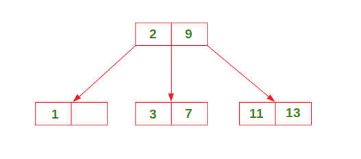
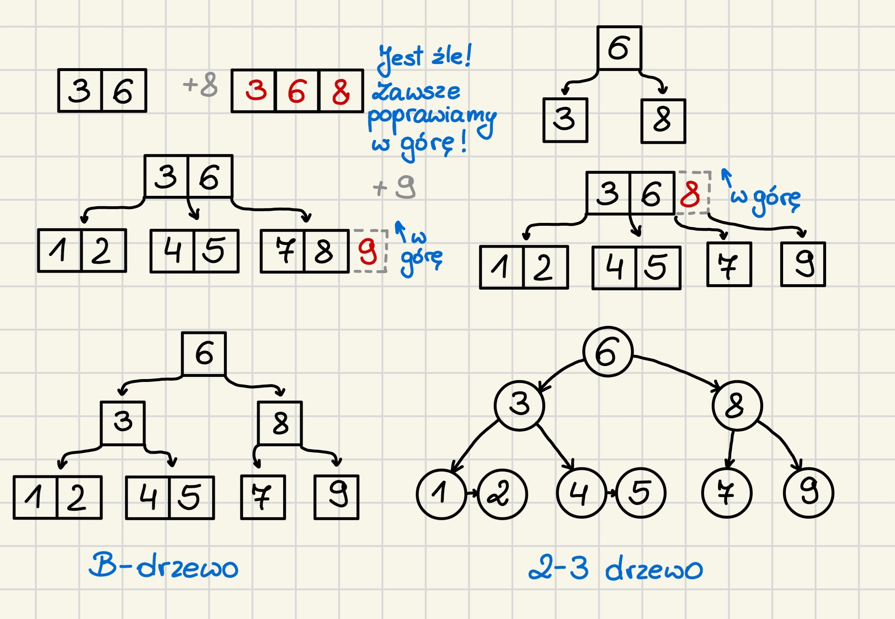
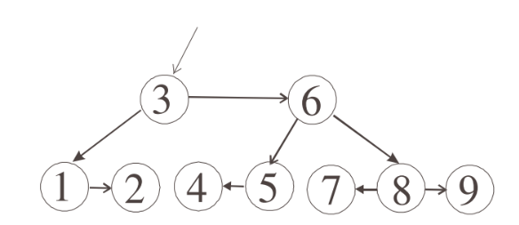

# 2-3 Drzewa

Są to samobalansujące drzewa wyszukiwań, będące szczególnym przypadkiem **B-drzew**. Każdy węzeł może przechowywać **1 lub 2 klucze**, a wszystkie liście znajdują się na **tym samym poziomie**.
Drzewa 2–3 gwarantują logarytmiczną wysokość bez jawnych rotacji.

## Właściwości drzew 2–3

- może mieć maksymalnie **2 klucze** i **3 wskaźniki**
- klucze w węźle są **uporządkowane**  
- wszystkie liście są na **tym samym poziomie**  
- drzewo jest **zawsze zbalansowane**  
- wyszukiwanie, wstawianie, usuwanie: **O(log n)**  
- wstawianie może powodować **rozszczepienie węzłów**



Struktura węzła:

```c
struct node {
    int key[2];        // 1 lub 2 klucze
    node* child[3];    // 2 lub 3 dzieci
    int k;             // liczba kluczy (1 lub 2)
};
```

Proces dodawania elementów:


Przepisanie B-drzewa na 2-3-drzewo:


Schemat konstruowania:


<br>

# 2-3-4 Drzewa

**Drzewo 2–3–4** to samobal

ansujące drzewo wyszukiwań.
Każdy węzeł może zawierać **1, 2 lub 3 klucze**.



### Właściwości

- klucze w węźle są uporządkowane  
- wszystkie liście **są na tym samym poziomie**  
- drzewo jest zawsze **zbalansowane**
- wyszukiwanie, wstawianie, usuwanie: **O(log n)**

Struktura 2-3-4-drzewa

```c
struct node {
    int key[3];        // 1–3 klucze
    node* child[4];    // 2–4 dzieci
    int k;             // liczba kluczy (1–3)

    node* left, right;  // do sprawdzenia
};
```

## Porównanie drzew

**Podobieństwa**

- samobalansujące drzewa wyszukiwań  
- szczególne przypadki **B-drzew**  
- klucze w węzłach są uporządkowane  
- wszystkie liście na tym samym poziomie  
- gwarantowana wysokość **O(log n)**  
- operacje: wyszukiwanie, wstawianie, usuwanie w **O(log n)**  

<br>

**Różnice**

| Cecha                 | 2–3 drzewo | 2–3–4 drzewo         |
| --------------------- | ---------- | -------------------- |
| Liczba kluczy w węźle | 1 lub 2    | 1, 2 lub 3           |
| Liczba dzieci         | 2 lub 3    | 2, 3 lub 4           |
| Odpowiednik B-drzewa  | rząd 1     | rząd 2               |
| Struktura             | prostsza   | bardziej rozbudowana |
| Stopień rozgałęzienia | mniejszy   | większy              |
| Wysokość drzewa       | większa    | mniejsza             |

<br>

**Wniosek**

- **2–3–4 drzewo** jest „szersze i niższe”  
- **2–3 drzewo** jest „węższe i wyższe”  
