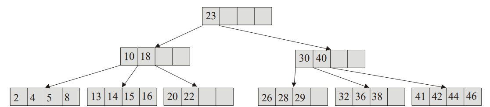
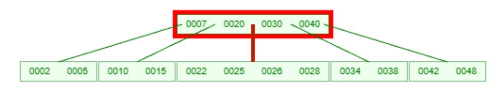
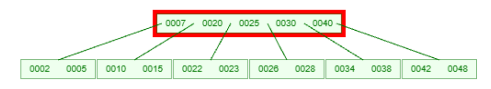

# B drzewa

B-drzewo to **zrównoważone drzewo wyszukiwań**, w którym każdy węzeł może przechowywać **wiele kluczy i wiele dzieci**.  
Jest szeroko stosowane w **systemach baz danych i systemach plików**, ponieważ minimalizuje liczbę operacji dyskowych.

---

## Właściwości B-drzew

- wszystkie liście są na **tym samym poziomie**
- klucze w węźle są **uporządkowane**
- struktura zawiera **k** kluczy, które należy do przedziału **[m, 2m]**
- struktura ma **k+1** wskaźników na dolne elementy
- operacje: wyszukiwanie, wstawianie, usuwanie → **O(log n)**

#### Definicje:

**Rząd B-drzewa** (`m`): minimalna liczba kluczy w każdej stronie (poza korzeniem); strona ma od **m do 2m kluczy

**Liczba `k`**: aktualna liczba kluczy zapisanych w danej stronie

<br>



<br>

Struktura:

```c
struct node
{
    int key[2m + 1];  // klucze indeksowane od 1, zerowy to wartownik
    node* next[2m + 1];
    int k;  // stopień
}
```

Wyszukiwanie rekurencyjne

```js
node* Search(node* root, int value)
{
    if (!root)
        return NULL;

    root->key[0] = -Infinity;
    int i = root->k;

    while (root->key[i] > value)
        i--;
    if (root->key[i] == value)
        return root;

    return Search(root->next[i], value);
}
```

Wizualizacja wstawiania `23` do pełnego drzewa:

Startowe drzewo


Element `23` nie mieści się w root



Wstawiamy do wskaźnika pomiędzy 20 a 30


Teraz struktura poniżej jest przeciążona


Środkowy element z przeciążonej struktury propagujemy do góry



Rozbijamy górny węzeł na 2 mniejsze, a aktualny środkowy element będzie je łączym 
i pełnił rolę root'a


#### Usuwanie

Dodając - zawsze szliśmy w górę
Usuwając - zawsze idziemy w dół
