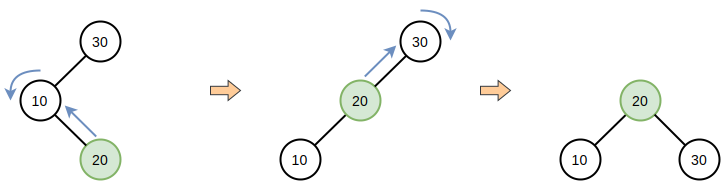
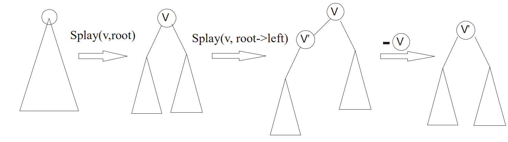
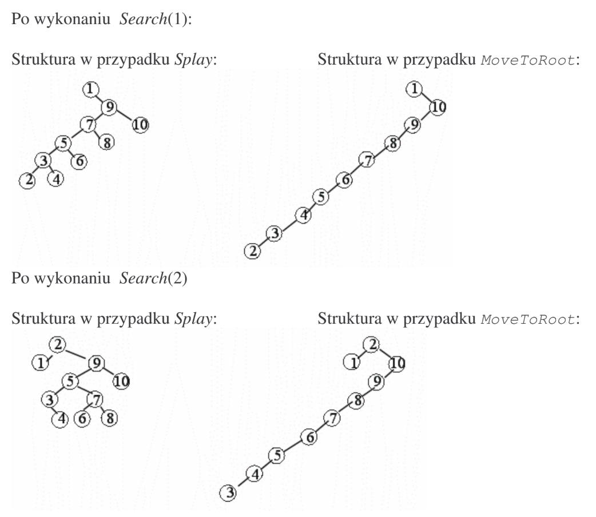

# Drzewa Splay

### Samoorganizujące się

Drzewo Splay jest samoorganizującą się strukturą, gwarantującą efektywny dostęp do pól danych na podstawie częstotliwości ich pojawiania się.

Właściwości:

- złożoność pesymistyczna: **O(n)**

- złożoność średnia/zamortyzowana: **O(log n)**

Wizualizacja funkcji **Splay(5)**


```c
void Splay(node* &root, int value)
{
    node* p = root;

    // Schodzimy w dół do szukanego elementu
    while (p->key != value)
    {
        if (value > p->key) {
            if (p->left)
                p = p->left;
            else
                break;
        } else {
            if (p->right)
                p = p->right;
            else
                break;
        }
    }

    // Propagowanie "p" do root'a
    while (p->parent != NULL)
    {
        node* rodzic = p->parent;
        node* dziadek = rodzic->parent;

        if (!grandparent) {
            // ZIG
            if (p == parent->left)
                Lzig(parent);
            else
                Rzig(parent);
        } else {
            // Sprawdzamy w jakim położeniu względem siebie
            // są węzeł 'p' oraz 'dziadek'
            int i = where_is(p, dziadek);
            switch (i)
            {
                case 1:     // LL
                    LZigZig(grandparent);
                    break;
                case 2:     // LR
                    LZigZag(grandparent);
                    break;
                case 3:     // RL
                    RZigZag(grandparent);
                    break;
                case 4:     // RR
                    RZigZig(grandparent);
                    break;
            }
        }
    }
    root = p;
}


// Funkcja where_is mogłaby wyglądać tak:
int where_is(node* p, node* g) {
    if (g->left && g->left->left == p)  return 1; // LL
    if (g->left && g->left->right == p) return 2; // LR
    if (g->right && g->right->left == p) return 3; // RL
    if (g->right && g->right->right == p) return 4; // RR
    return 0;
}
```

**Uwaga!**

Jeżeli wykonamy Splay(root, value) na elemencie, którego nie ma w drzewie, to funkcja wyniesie do root'a wartość najbliższą do **`value`**. W zalezności od tego, którym poddrzewem szliśmy otrzymamy w roocie:

- lewe podrzewo: najbliższe, mniejsze od **`value`**

- prawe poddrzewo: najbliższe, większe od **`value`**

Sposoby cofania się w drzewach:

- dodanie do `node` parametru *parent*

- dodawanie kolejnych elementów na stacka (stos)

- rekurencyjnie

#### Funkcje zygzakowate


```c
void LZigZig (node* &p) 
{
    node* x = p->left;
    node* y = x->left;

    x->left = y->right;
    y->right = x;

    p->left = x->right;
    x->right = p;

    p = y;
}
```



```c
void LZigZag(node* &p)
{
    node* x = p->left;
    node* y = x->right;

    x->right = y->left;
    y->left = x;

    p->left = y->right;
    y->right = p;

    p = y;
}
```


Szukanie

```cpp
node* Search(int value)
{
    Splay(root, value);
    if (root->key == value)
        return root;
    return NULL;
}
```

Wstawianie 

```c
node* Insert(int value)
{
    Splay(root, value);  // Jeżeli value było w drzewie to teraz w root
    if (root->key == value)
        return root;     // Zwracamy root'a bo value już tam jest

    // Jeżeli value nie istaniało w drzewie
    node* nowy = new node(value);
    if (root->key < value) {
        nowy->left = root;
        nowy->right = root->right;
        root->right = NULL;
    }
    else {
        nowy->left = root->left;
        nowy->right = root;
        root->left = NULL;
    }
    
    root = nowy;
    return nowy;    
}
```

Usuwanie - zgodnie z rysunkiem



Chcemy usunąć z drzewa węzeł **`value`**

1. Splay(root, value) aby mieć naszą wartość **`value`** na górze

2. Potem bierzemy dowolnie prawą lub lewą stronę - teraz weźmy lewą

3. Na lewym poddrzewie wykonujemy Splay(root->left, value)
   
   - przez to w root lewego poddrzewa dostaliśmy najbliższą, mniejszą wartość od **`value`** 

```cpp
void Delete(value)
{
    Splay(root, value);

    if (root->key != value) {
        print("Nie ma czego usunąć");
        return;
    }

    node* p = root;

    // Używamy lewego poddrzewa
    Splay(root->left, value);  // zwróci nam najbliższą wartość z lewego 

    node* lewe_poddrzewo = root->left;
    lewe_poddrzewo->right = root->right;
    root = lewe_poddrzewo;

    delete p;
}
```

## Złożoność Splay() jest zdecydowanie lepsza od MoveToRoot

Widać to na przykładzie posortowanej listy [10, 9, 8, 7, 6, 5, 4, 3, 2, 1]


