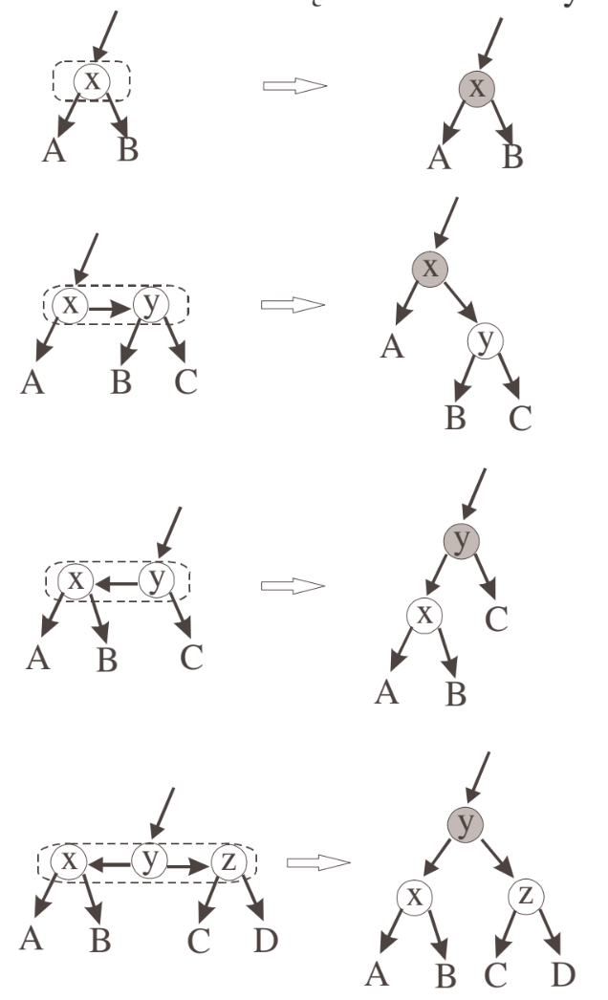
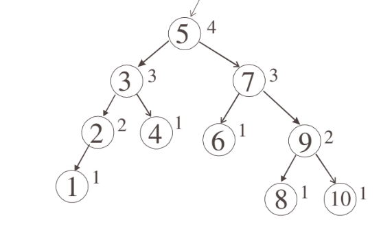
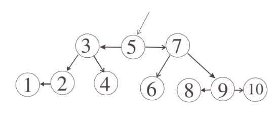
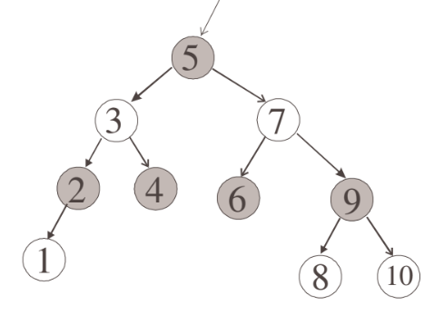
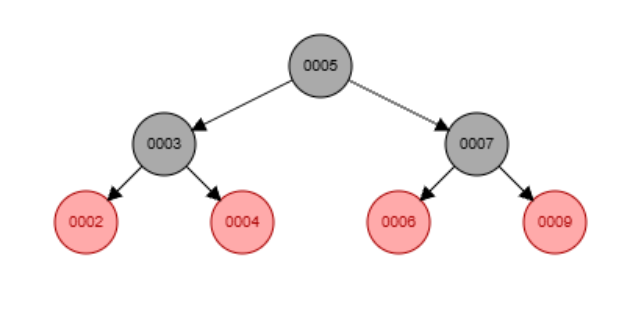
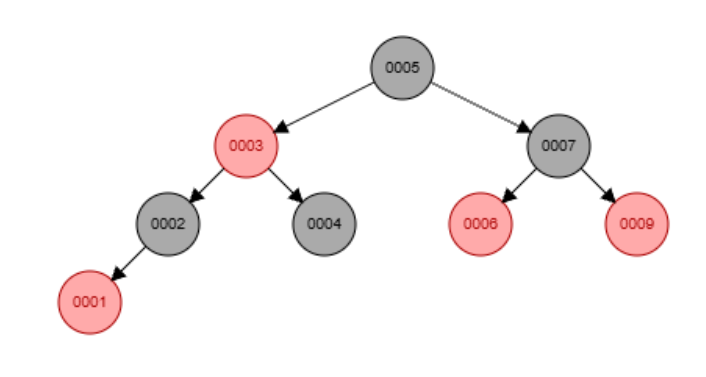
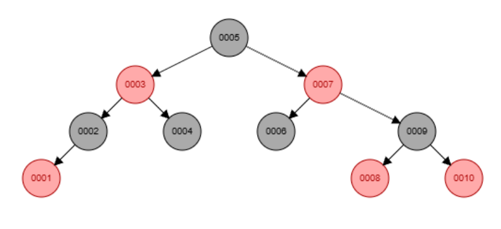

# Drzewa czerwono-czarne

Właściwości:

- Każdy węzeł: czerwony lub czarny

- Korzeń czarny

- Liście (NIL) czarne

- Czerwony nie ma czerwonego dziecka

- Każda ścieżka ma tyle samo czarnych węzłów

Są one pochodną 2-3-4 drzew

Zamiania 2-3-4-drzew na czerwono-czarne:

 

1. Najwyższy element jest czarny

2. Jeżeli na jednym poziomie jest kilka węzłów, to propagujemy w górę, aby otrzymać drzewo binarne

3. To co zeszło w dół jest czerwone

## Przykład tworzenia w związku z resztą struktur

#### 1. Mamy drzewo AVL

#### 2. Odpowiada mu następujące 2-3-4-drzewo

#### 3. Z 2-3-4-drzewa poprzez propagowanie poziomych elementów oraz kolorowanie od korzenia otrzymujemy następujące drzewo czerwono-czarne

#### 4. Jak wyglądały wcześniejsze ruchy?

Mieliśmy w połowie taką strukturę - zwróć uwagę na lewą stronę

Potem dodając węzęł **`1`**  musieliśmy zmienić kolory kierując się od góry

Finałowe drzewo wygląda następująco

