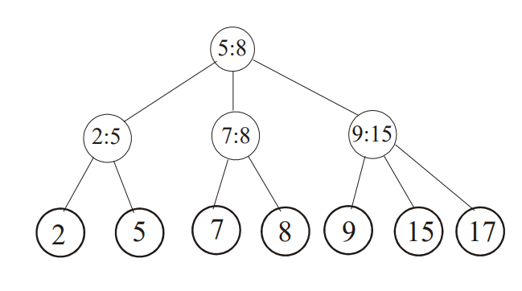

# Kolejki konkatenowalne

Kolejka konkatenowalna to rozszerzenie słownika, które oprócz operacji
Search, Insert, Delete umożliwia efektywne łączenie i dzielenie zbiorów
uporządkowanych.



#### Operacje nowe

- **Concatenate(S1, S2)**  
  - łączy dwa zbiory  
  - warunek: `∀a∈S1, b∈S2 : a < b`
- **Split(a, S)**  
  - dzieli zbiór na:
    - `S1 = {x | x ≤ a}`
    - `S2 = {x | x > a}`

#### Implementacja

- może być realizowana jako **2–3 drzewo**  
- elementy przechowywane **tylko w liściach**
- możliwa także implementacja przy użyciu **drzew Splay**

#### Złożoność

- **Search, Insert, Delete**: `O(log n)`
- **Concatenate**: `O(|h₁ − h₂|)`
- **Split**:
  - naiwnie: `O(log² n)`
  - z powrotem w górę drzewa: **`O(log n)`**

Struktura

```c
struct node {
    int height;
    int key;
    int L, M;
    node* left, mid, right;
};
```

Wyszukiwanie

```c
node* Search(int value)
{
    node* ptr = root;
    while (ptr) {
        if (!ptr->left)  // Nie ma żadnych elementów poniżej
            return (ptr->key == value) ? ptr : NULL;

        if (value <= ptr->L)
            ptr = ptr->left;

        else if (value <= ptr->M)
            ptr = ptr->mid;

        else
            ptr = ptr->right;
    }
    return NULL;
}
```

#### Concatenate

Operacja ta polega na połączeniu dwóch drzew o różnych wysokościach. W pierwszym kroku w wyższym drzewie odnajduje się skrajny lewy lub prawy węzeł znajdujący się na poziomie równym różnicy wysokości obu drzew. Następnie do tego węzła dołączane jest drugie drzewo w zależności od tego, z której strony braliśmy węzeł. Z tego powodu złożoność operacji **Concatenate** jest proporcjonalna do różnicy wysokości łączonych drzew.

#### Split

```c
// Specyfikacja 
// root to wskaźnik na drzewo, które dzielimy
// rootL, rootR to drzewa wynikowe, na które zostanie podzielony root

void Split(node* root; int a, node* &rootL, node* &rootR) 
{
    // Brak
    if (!root) {
        rootL = rootR = NULL;
    }

    // Liść
    if (!root->left) {
        rootL = (a >= root->key) ? root : NULL;
        rootR = (a < root->key) ? root : NULL;
        return;
    }

    // w lewym poddrzewie
    if (a <= root->L) {
        Split(root->left, a, rootL, rootR);
        rootR = Concatenate(rootR, root->mid);
        rootR = Concatenate(rootR, root->right);
        return;
    }

    // w środkowym poddrzewie
    if (a <= root->M) {
        Split(root->mid, a, rootL, rootR);
        rootL = Concatenate(root->left, rootL);
        rootR = Concatenate(rootR, root->right);
        return;
    }

    // w prawym poddrzewie
    Split(root->right, a, rootL, rootR);
    rootL = Concatenate(root->mid, rootL);
    rootL = Concatenate(root->left, rootL);
    return;
}
```
