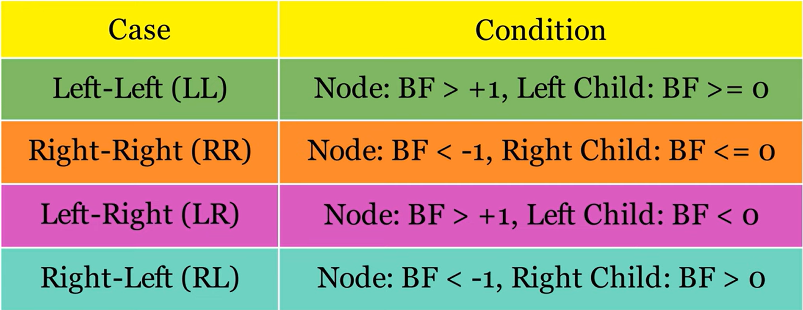
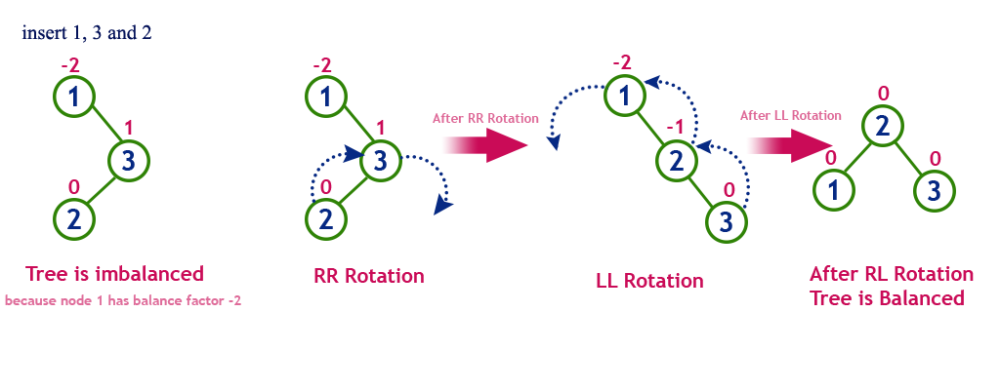

# Drzewa AVL


Właściwości:

- Jest to pochodna drzew BST - zachowane wartości mniejsze / większe

- Są one zrównoważone

- zawierają pole **```balans```**, które jest różnicą wysokości prawego i lewego podrzewa, powinno zawierać się w zbiorze {-1, 0, 1}

Są to drzewa gdzie dla każdego węzła wysokość podrzew różni się nie więcej niż o 1 poziom. 

Struktura węzła:

```c
struct node{
    int key;
    int balans;
    node* left, right;
}

ALBO: node* next[2];
```

Mogą wystąpić 4 typy nierówności



**Rotacja Right-Left**



## Implementacje funkcji wyrównywania

**Rotacja Right-Right**

```c
void RR(node* &p)
{
    node* x = p->right;
    p->right = x->left;
    x->left = p;

    p->balans = (x->balans == -1) ? 0 : -1;
    x->balans = (x->balans == -1) ? 0 : 1;

    p = x;
}
```

**Rotacja Left-Left**

```c
void LL(node* &p)
{
    node* x  = p->left;
    p->left = x->right;
    x->right = p;

    p->balans = (x->balans == 1) ? 0 : 1;
    x->balans = (x->balans == 1) ? 0 : -1;

    p = x;
}
```

**Rotacja Left-Right**

```js
void LR(node* &p)
{
    node* x = p->left;
    node* y = x->right;

    x->right = y->left;
    p->left = y->right;
    y->left = x;
    y->right = p;

    p->balans = (y->balans == 1) ? -1 : 0; // trzeba pamiętać, że są 3
    x->balans = (y->balans == -1) ? 1 : 0; // przypadki: if() => pierwszy
    y->balans = 0;                         // else() => dwa pozostałe

    p = y;
}
```

**Rotacja Right-Left**

```c
void RL(node* &root)
{

}
```

Warto zauważyć, że złożoność jest stała

## Wstawianie do drzewa AVL

```js
void Insert(node* &root, int value, bool &czy_urosło)
{
    node* p;

    // Warunek końcowy rekurencji - wstawia nowy element
    if (!root)
    {
        root = new node(value);
        czy_urosło = true;
        return;
    }

    // Lewe poddrzewo
    if (root->key > value)
    {
        Insert(value, root->left, czy_urosło);
        if(czy_urosło){
            switch (root->balans){
                case 1:               // lewe było ciężkie
                    p = root->left;
                    if (p->balans == 1 || p->balans == 0)        
                        LL(root);
                    else
                        LR(root);
                    czy_urosło = false;
                    break;

                case 0:               // było idealnie
                    root->balans = 1;
                    break;

                case -1:              // prawe było ciężkie   
                    root->balans = 0;
                    czy_urosło = false;
                    break;
            }
        }
        return;
    }

    // Prawe poddrzewo
    if (root->key < value)
    {
        Insert(root->right, value, czy_urosło);

        if (czy_urosło){
            switch (root->balans){
                case 1:
                    root->balans = 0;
                    czy_urosło = false;
                    break;

                case 0 :
                    root->balans = -1;
                    break;

                case -1:
                    if (p->balans == -1 || p->balans == 0)
                        RR(root);
                    else
                        RL(root);
                    czy_urosło = false;
                    break;
            }
        }
        return;
    }
    czy_urosło = false;
}
```
